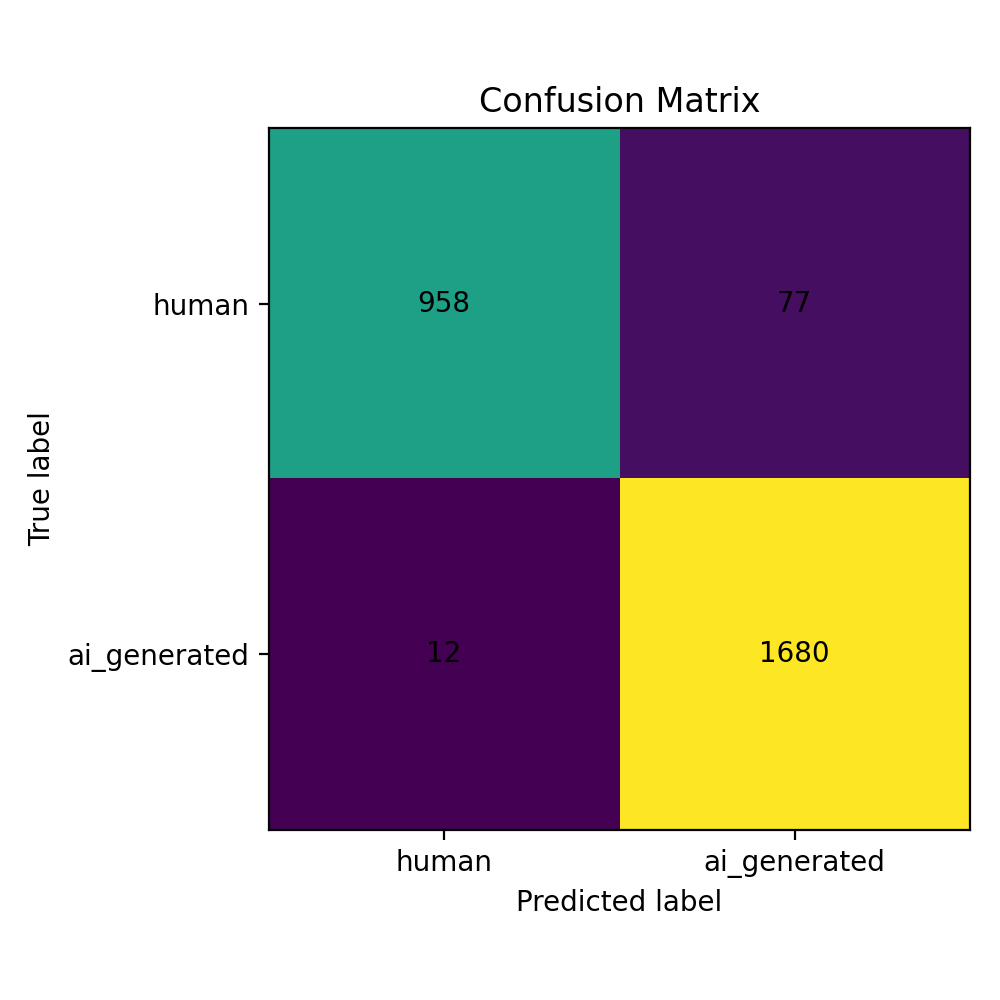
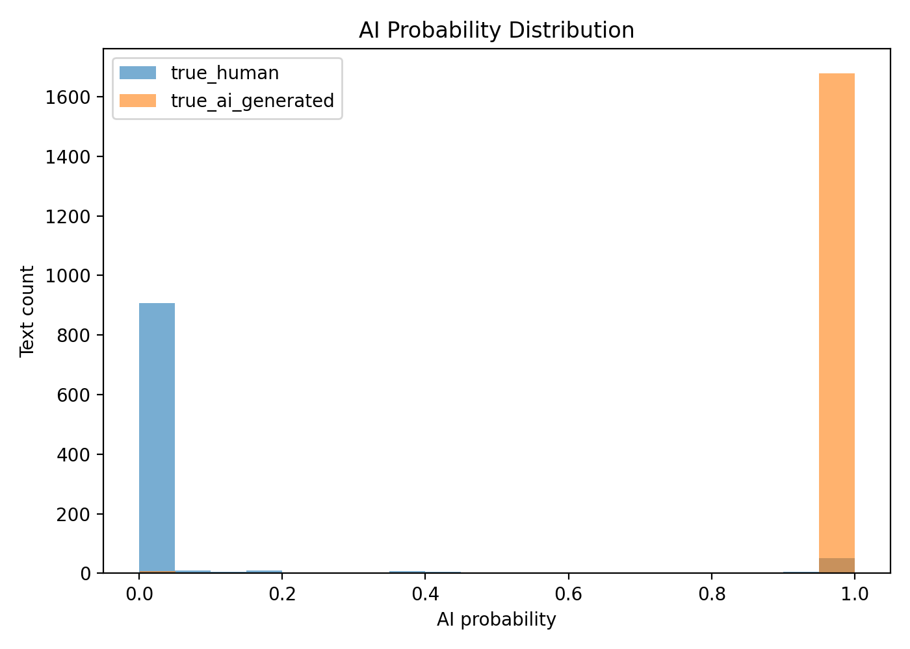
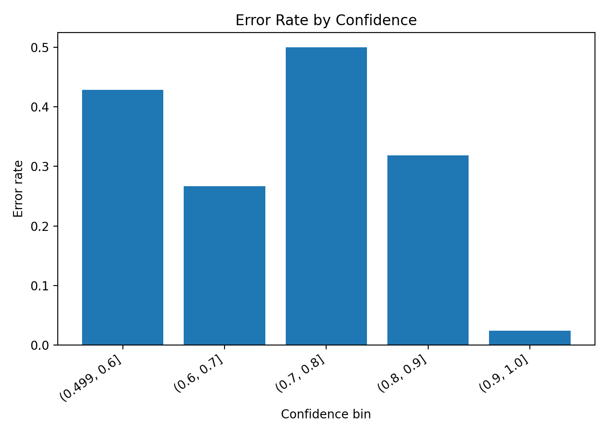
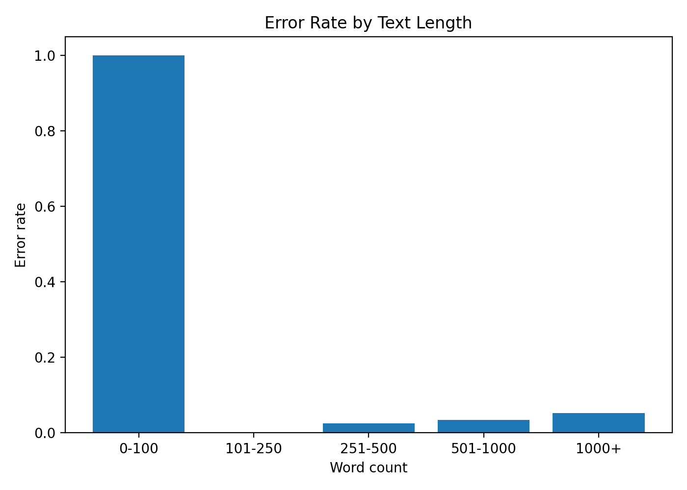

# AI Text Detector

A binary AI-text detection project using **DeBERTa-v3-base** combined with handcrafted stylometric features. The model classifies texts as either **human-written** or **AI-generated**.

## Overview

The detector is made up of 2 components:

1. A transformer text representation from `microsoft/deberta-v3-base`
2. A handcrafted stylometric feature vector extracted from the input text

The DeBERTa `[CLS]` representation is concatenated with the stylometric features and passed through a small classification head.

The stylometric features include:

- word count
- sentence count
- average sentence length
- sentence length variance
- average word length
- type-token ratio
- MTLD <a href="https://link.springer.com/article/10.3758/BRM.42.2.381" target="_blank">McCarthy and Jarvis (2010)</a>
- punctuation rate
- comma rate
- em dash rate
- uppercase ratio
- digit ratio
- stopword ratio

## Results

The best checkpoint was selected using validation F1.

### Validation performance

| Metric | Score |
|---|---:|
| Accuracy | 0.9637 |
| F1 | 0.9714 |
| Precision | 0.9508 |
| Recall | 0.9929 |
| Loss | 0.2213 |

### Test performance

| Metric | Score |
|---|---:|
| Accuracy | 0.9674 |
| F1 | 0.9742 |
| Precision | 0.9562 |
| Recall | 0.9929 |

### Test confusion matrix

|  | Predicted human | Predicted AI |
|---|---:|---:|
| True human | 958 | 77 |
| True AI | 12 | 1680 |

The model has high recall for AI-generated text, meaning it misses relatively few AI-generated samples. The main tradeoff is that some human-written samples are incorrectly flagged as AI-generated, a limitation that is found in many AI-text detectors

## Visualizations

### Confusion matrix



### AI probability distribution



### Error rate by confidence



### Error rate by text length



## Project structure

```text
ai_text_detector/
├── configs/
│   └── train_config.yaml
├── data/
│   └── README.md
├── models/
│   └── README.md
├── results/
│   ├── metrics.json
│   ├── test_metrics.json
│   ├── classification_report.txt
│   ├── validation_confusion_matrix.json
│   ├── test_confusion_matrix.json
│   ├── confusion_matrix.png
│   ├── probability_distribution.png
│   ├── confidence_vs_error.png
│   └── error_by_text_length.png
├── scripts/
│   └── create_splits.py
├── src/
│   └── ai_detector/
│       ├── __init__.py
│       ├── data.py
│       ├── evaluate.py
│       ├── features.py
│       ├── model.py
│       ├── predict.py
│       ├── train.py
│       ├── utils.py
│       └── visualize.py
├── pyproject.toml
├── requirements.txt
└── README.md
```

## Training configuration

The final reported run used the following main settings:

```yaml
model_name: microsoft/deberta-v3-base
max_length: 256
batch_size: 8
eval_batch_size: 16
epochs: 2
deberta_learning_rate: 0.000001
classifier_learning_rate: 0.0001
dropout: 0.2
hidden_dim: 256
style_feature_dim: 13
```

## Setup

Create and activate a Conda environment:

```bash
conda create -n ai_detector python=3.11
conda activate ai_detector
```

Install dependencies:

```bash
pip install -r requirements.txt
pip install -e .
```

## Data format

The training, validation, and test files are expected to be JSONL files with at least the following fields:

```json
{"text": "Example text here...", "label": 0}
```

Labels:

```text
0 = human-written
1 = AI-generated
```

Expected local paths:

```text
data/raw/train.jsonl
data/raw/val.jsonl
data/raw/test.jsonl
```

## Training

Run:

```bash
python -m ai_detector.train --config configs/train_config.yaml
```

The training script saves:

```text
models/ai_detector/best_model_state.pt
models/ai_detector/scaler.joblib
models/ai_detector/tokenizer/
models/ai_detector/train_config.yaml
results/metrics.json
results/validation_confusion_matrix.json
```

## Evaluation

Run:

```bash
python -m ai_detector.evaluate --config configs/train_config.yaml
```

This generates:

```text
results/test_metrics.json
results/test_confusion_matrix.json
results/classification_report.txt
results/predictions.csv
```

## Visualization

Run:

```bash
python -m ai_detector.visualize --config configs/train_config.yaml
```

This generates plots such as:

```text
results/training_history.png
results/confusion_matrix.png
results/probability_distribution.png
results/confidence_vs_error.png
results/error_by_text_length.png
```

## Important limitations

This project should not be treated as a production-ready AI detector.

The reported scores are measured on a held-out split from the same dataset family, not on a fully independent real-world benchmark. AI-text detection is sensitive to dataset source, writing domain, prompt style, model family, text length, and paraphrasing.

A more completed model is currently in production.
